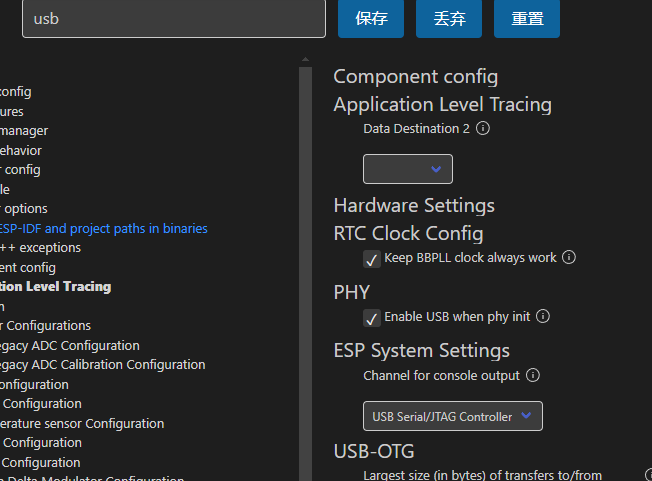

# ESP32-S3 JTAG-serial 配置

::: tip 参考
[ESP32-USB Serial/JTAG Controller 使用](https://blog.csdn.net/ai_ljh/article/details/126999395)
:::

## SDK 配置



## 烧录

烧录方式选择 `UART`
按住 `boot键` 然后按一下 `en键` 进入 `DFU` 模式

## 发送 /  接收


```c
// printf
char *msg = "LED BLINK\n";
printf("%s", msg);

// hal库
#include "hal/usb_serial_jtag_ll.h"
void usb_rx_task(void *pv)
{
    uint8_t *rxbuf;
    int cnt;
    rxbuf = (uint8_t *)malloc(64);
    int rxcnt;
    while (1)
    {
        if (usb_serial_jtag_ll_rxfifo_data_available()) // 等待接收buf非空
        {
            rxcnt = usb_serial_jtag_ll_read_rxfifo(rxbuf, 64);                         // 接收buf中的所有数据
            cnt = (int)usb_serial_jtag_ll_write_txfifo((const uint8_t *)rxbuf, rxcnt); // 将接收数据回环发送
            usb_serial_jtag_ll_txfifo_flush();                                         // 刷新发送buf
            printf("Send %d characters to host \n", cnt);                              // 在调试串口打印发送的数量
        }
        vTaskDelay(pdMS_TO_TICKS(10));
    }
    free(rxbuf); // 与malloc成对使用
    vTaskDelete(NULL);

}
```
