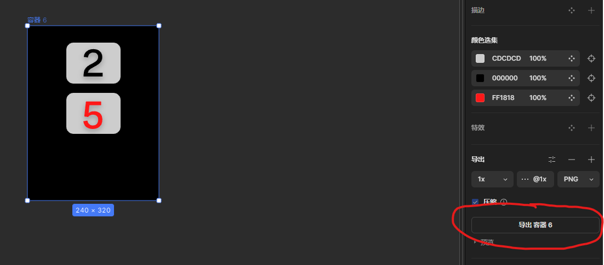
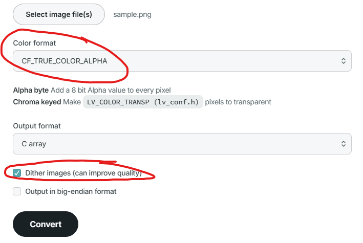

# LVGL  图片使用

## 方法一 使用SQUARE LINE 导出文件 `C` 格式

从 `mastergo` 导出 `png` 图片



导入到 `square line` 项目文件夹中的 `assets` 文件夹中

## 方法二 使用线上工具
::: info
[LVGO.IO - IMAGE CONVERTER](https://lvgl.io/tools/imageconverter)
:::

::: warning 注意
最好再png文件名改好名字和尺寸 生成后的名字跟文件名是一样的
:::



## 导入 `c` 文件到项目中 使用

### declare 声明
```cpp
// 声明图片
extern LV_IMG_DECLARE(sample);
```

### 使用
```c

void ui_Home_screen(void)
{
    Home_screen = lv_obj_create(NULL);
    IMG_PNG = lv_img_create(Home_screen);
    lv_img_set_src(IMG_PNG, &sample);
    lv_obj_set_width(IMG_PNG, 240);
    lv_obj_set_height(IMG_PNG, 320);
    lv_obj_set_x(IMG_PNG, 0);
    lv_obj_set_y(IMG_PNG, 0);
    lv_obj_clear_flag(IMG_PNG, LV_OBJ_FLAG_SCROLLABLE);
}
```


