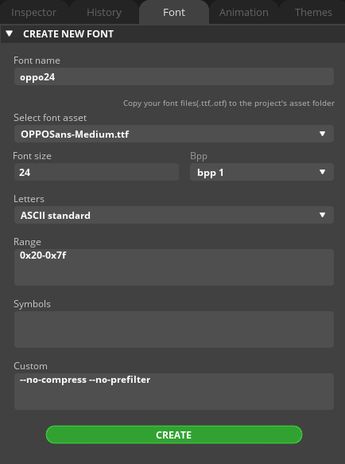
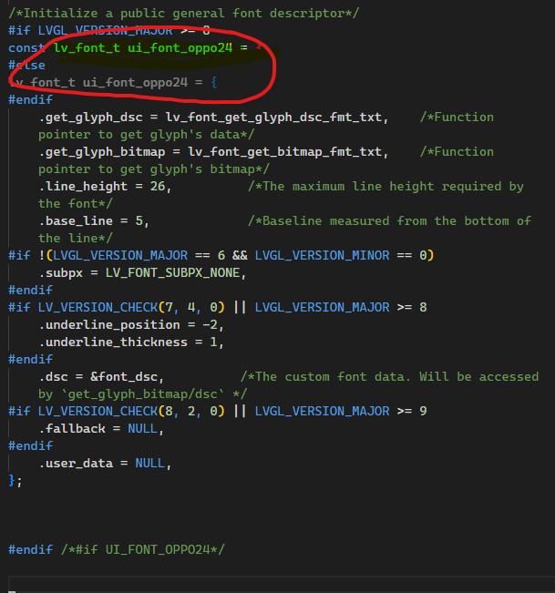

# LVGL 字体使用


## 方法一 使用LVGL在线字体生成器
::: info 
[LVGL在线字体生成器](https://lvgl.io/tools/fontconverter)
未实验成功

:::

## 方法二 使用 `SQUARE LINE` 导出文件 `C` 格式

把 `ttf` 字体文件导入到 `square line` 项目文件夹中的 `assets` 文件夹中

在项目中生成尺寸为 `24` 的字体文件

::: warning 
注意 `font name` 要由 名字和尺寸 组成 比如 `font_24`

## 复制到项目中使用

找到字体的名字 比如 `ui_font_oppo24`


### declare 声明
```cpp
LV_FONT_DECLARE(ui_font_oppo24);
```

### 使用

```cpp

label = lv_label_create(Home_screen);
lv_label_set_text(label, "Hello World");
lv_obj_set_x(label, 0);
lv_obj_set_y(label, 78);
lv_obj_set_align(label, LV_ALIGN_CENTER);
lv_obj_set_style_text_font(label, &ui_font_oppo24,0);
```


