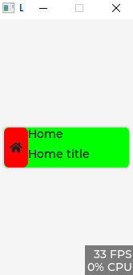

# LVGL GRID 布局

::: info 参考
[https://docs.lvgl.io/8.3/layouts/grid.html#example](https://docs.lvgl.io/8.3/layouts/grid.html#example)
:::

## 配置行列参数

```c
    static lv_coord_t col_dsc[] = {30, 130, LV_GRID_TEMPLATE_LAST};
    static lv_coord_t row_dsc[] = {25, 25, LV_GRID_TEMPLATE_LAST};
```

## 创建容器 并配置行列参数

```c
    lv_obj_t *btn = lv_obj_create(lv_scr_act());
    lv_obj_set_size(btn, 160, 54);
    lv_obj_center(btn);
    lv_obj_set_style_grid_column_dsc_array(btn, col_dsc, 0);
    lv_obj_set_style_grid_row_dsc_array(btn, row_dsc, 0);
    lv_obj_set_layout(btn, LV_LAYOUT_GRID); // 设置布局类型 设置后生效

```

## 消除边距 消除滚动条 和 滑动

```c
    lv_obj_set_style_pad_all(btn, 0, 0);
    lv_obj_set_style_pad_column(btn, 0, 0);
    lv_obj_set_style_pad_row(btn, 0, 0);

    lv_obj_set_scrollbar_mode(btn, LV_SCROLLBAR_MODE_OFF);
    lv_obj_set_scroll_dir(btn, LV_DIR_NONE);
```


## 元素放置

`lv_obj_set_grid_cell` 函数
- 第一个参数 放置的元素
- 第二个参数 水平对齐方式
- 第三个参数 水平对齐的位置
- 第四个参数 水平占用的格子数
- 第五个参数 垂直对齐方式
- 第六个参数 垂直对齐的位置
- 第七个参数 垂直占用的格子数

```c
lv_obj_t *Grid_item = lv_obj_create(["grid_container"]);

lv_obj_set_grid_cell(Grid_item, LV_GRID_ALIGN_STRETCH, 0, 1, LV_GRID_ALIGN_STRETCH, 0, 1);

```

## example



```c

void obj_anim()
{
    // 配置行列参数
    static lv_coord_t col_dsc[] = {30, 130, LV_GRID_TEMPLATE_LAST};
    static lv_coord_t row_dsc[] = {25, 25, LV_GRID_TEMPLATE_LAST};
    // 创建窗口
    lv_obj_t *scr = lv_obj_create(NULL);

    // 创建容器 并配置行列参数
    lv_obj_t *btn = lv_obj_create(scr);
    lv_obj_set_style_grid_column_dsc_array(btn, col_dsc, 0);
    lv_obj_set_style_grid_row_dsc_array(btn, row_dsc, 0);
    lv_obj_set_layout(btn, LV_LAYOUT_GRID); // 设置布局类型 设置后生效

    // 样式设置
    lv_obj_set_size(btn, 160, 54);
    lv_obj_align(btn, LV_ALIGN_CENTER, 0, 0);
    lv_obj_set_style_bg_color(btn, lv_color_hex(0x00ff00), 0);
    lv_obj_add_flag(btn, LV_OBJ_FLAG_CLICKABLE);
    // 添加焦点动画时间
    lv_obj_add_event_cb(btn, anim_e, LV_EVENT_FOCUSED, NULL);
    // 消除边距 消除滚动条 和 滑动
    lv_obj_set_style_pad_all(btn, 0, 0);
    lv_obj_set_style_pad_column(btn, 0, 0);
    lv_obj_set_style_pad_row(btn, 0, 0);
    lv_obj_set_scrollbar_mode(btn, LV_SCROLLBAR_MODE_OFF);
    lv_obj_set_scroll_dir(btn, LV_DIR_NONE);

    // 元素放置 此元素坐标 col 0 , row 0, col span 1 , row span 2
    lv_obj_t *obj_home = lv_obj_create(btn);
    lv_obj_set_scrollbar_mode(obj_home, LV_SCROLLBAR_MODE_OFF);
    lv_obj_set_scroll_dir(obj_home, LV_DIR_NONE);
    lv_obj_set_grid_cell(obj_home, LV_GRID_ALIGN_STRETCH, 0, 1, LV_GRID_ALIGN_STRETCH, 0, 2); // 此元素坐标 col 0, row 0, col span 1, row span 2
    lv_obj_set_style_bg_color(obj_home, lv_color_hex(0xff0000), 0);
    lv_obj_t *symbol_home = lv_label_create(obj_home);
    lv_label_set_text(symbol_home, LV_SYMBOL_HOME);
    lv_obj_center(symbol_home);
    lv_obj_set_style_border_width(obj_home, 0, 0);

    // 元素放置
    lv_obj_t *title = lv_label_create(btn);
    lv_label_set_text(title, "Home");
    lv_obj_set_grid_cell(title, LV_GRID_ALIGN_STRETCH, 1, 1, LV_GRID_ALIGN_STRETCH, 0, 1);
    lv_obj_set_style_pad_all(title, 0, 0);

    lv_obj_t *title2 = lv_label_create(btn);
    lv_label_set_text(title2, "Home title");
    lv_obj_set_grid_cell(title2, LV_GRID_ALIGN_STRETCH, 1, 1, LV_GRID_ALIGN_STRETCH, 1, 1);
    // lv_obj_center(title2);
    lv_obj_set_style_pad_all(title2, 0, 0);


    lv_scr_load(scr);
}
```

动画回调函数
```c
void anim_e(lv_event_t *e)
{
    lv_obj_t *obj = lv_event_get_target(e);
    lv_obj_t *label = lv_obj_get_child(obj, NULL);
    // lv_label_set_text(label, "Button Clicked!");
    int x = lv_obj_get_width(obj);
    lv_anim_t a;
    lv_anim_init(&a);
    lv_anim_set_var(&a, obj);
    lv_anim_set_time(&a, 50);
    lv_anim_set_delay(&a, 0);
    lv_anim_set_path_cb(&a, lv_anim_path_ease_in_out);
    lv_anim_set_repeat_count(&a, 1);
    lv_anim_set_playback_time(&a, 50);
    lv_anim_set_playback_delay(&a, 0);

    lv_anim_set_exec_cb(&a, (lv_anim_exec_xcb_t)lv_obj_set_width);
    lv_anim_set_values(&a, x, x+10);

    lv_anim_start(&a);
}
```

