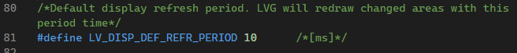

# LVGL 移植到 `ESP32-S3`


::: tip 移植视频
[PlatformIO和arduino移植lvgl](https://www.bilibili.com/video/BV1B1vbetEKx/?spm_id_from=333.1007.top_right_bar_window_history.content.click&vd_source=2097425578c361917ecd9ca79dce6b72)
:::

::: tip
框架: Arduino
平台: platformIO
开发板: ESP32-S3 / T-display s3
lvgl版本: 8.3.10
platformIO esp32版本: 6.5.0
:::

## `platfromIO.ini` 配置
```ini
[env:esp32-s3-devkitc-1]
platform = espressif32
board = esp32-s3-devkitc-1
framework = arduino

board_build.arduino.memory_type = qio_opi 
board_build.f_flash = 80000000L
board_build.flash_mode = qio

build_flags = 
    -DBOARD_HAS_PSRAM
```


## 配置 TFT 驱动

使用 `TFT_eSPI` 驱动

`Github`
[T-Display-S3](https://github.com/Xinyuan-LilyGO/T-Display-S3.git)    

把配置号的 `TFT_eSPI` 库 放到 `lib` 文件夹下     
`T-Display-S3` 还有个 `pin_config.h` 文件专门针对 `TFT_eSPI` 驱动的引脚配置    
具体使用方法看 下面的链接
 [T-Display-S3 / examples
/ tft /](https://github.com/Xinyuan-LilyGO/T-Display-S3/tree/main/examples/tft)


## 移植 LVGL

`Github` 
[LVGL Release v8.3.10](https://github.com/lvgl/lvgl/releases/tag/v8.3.10)  

放到 `lib` 文件夹下

把 `lv_conf_template` 放到 `lib` 文件夹下 重命名为 `lv_conf.h` 

目录结构如下
    

### 修改 `lv_conf.h`

修改两个地方如图


15行 `if 0` 改为 `if 1`  表示开启 `LVGL` 中文库   


88行 `define LV_TICK_CUSTOM 0` 改为 `define LV_TICK_CUSTOM 1` 表示开启 `LVGL` 自定义时钟  


修改刷新时间为 `10` ms


### 制作 `lv_driver` 

1. 在 `lib` 文件夹下新建 `lv_driver` 文件夹
2. 在 `.\lib\lvgl\examples\porting` 里找到 `lv_port_disp_templ.c` 复制到 `lv_driver` 文件夹下 重命名为 `lv_port_disp.cpp`
3. 在 `.\lib\lvgl\examples\porting` 里找到 `lv_port_disp_templ.h` 复制到 `lv_driver` 文件夹下 重命名为 `lv_port_disp.h`
4. `lv_port_disp.h` 添加头文件
```cpp
#include "lvgl.h"
#include "TFT_eSPI.h"
#include "Arduino.h"
#include "pin_config.h"   // 这是 T-Display-S3 的引脚配置文件
#include "esp_heap_caps.h"   // 这是 esp32 的堆管理文件
```
5. `lv_port_disp.cpp` 修改
1# 打开开关

2# 定义显示设备长宽

3# TFT_eSPI 初始化


4# disp flush 函数
```cpp
static void disp_flush(lv_disp_drv_t *disp_drv, const lv_area_t *area, lv_color_t *color_p)
{
    // if (disp_flush_enabled)
    // {
        /*The most simple case (but also the slowest) to put all pixels to the screen one-by-one*/

        uint32_t w = (area->x2 - area->x1 + 1);
        uint32_t h = (area->y2 - area->y1 + 1);

        tft.startWrite();
        tft.setAddrWindow(area->x1, area->y1, w, h);
        tft.pushColors((uint16_t *)&color_p->full, w * h, true);
        tft.endWrite();

        lv_disp_flush_ready(disp_drv);
    // }

    /*IMPORTANT!!!
     *Inform the graphics library that you are ready with the flushing*/
    // lv_disp_flush_ready(disp_drv);
}
```

6. 缓存
   选择双缓存 或者使用 `psram`
   使用 `psram` 时 记得在 `platformIO.ini` 配置 `board_build.arduino.memory_type = qio_opi` `board_build.flash_mode = qio`  `build_flags = 
    -DBOARD_HAS_PSRAM` `board_build.f_flash = 80000000L`  这四个参数
    `psram` 配置
    ```cpp
    static lv_disp_draw_buf_t draw_buf_dsc_2;
    static lv_color_t *buf_2_1_qio = NULL;
    static lv_color_t *buf_2_2_qio = NULL;

    buf_2_1_qio = (lv_color_t *)heap_caps_malloc(MY_DISP_HOR_RES * 10 * sizeof(lv_color_t), MALLOC_CAP_SPIRAM);
    buf_2_2_qio = (lv_color_t *)heap_caps_malloc(MY_DISP_HOR_RES * 10 * sizeof(lv_color_t), MALLOC_CAP_SPIRAM);

    lv_disp_draw_buf_init(&draw_buf_dsc_2, buf_2_1_qio, buf_2_2_qio, MY_DISP_HOR_RES * 10); /*Initialize the display buffer*/
    ```
    修改 `disp_drv.draw_buf` 为 `draw_buf_dsc_2`
    `disp_drv.draw_buf = &draw_buf_dsc_2;`

### 使用 
`main.cpp`
```cpp
#include <Arduino.h>
#include "lv_port_disp.h"
```
```cpp
void setup()
{
    lv_init();
    lv_port_disp_init();
    lv_obj_t *label = lv_label_create(lv_scr_act());
    lv_label_set_text(label, "Hello World!");
    lv_obj_align(label, LV_ALIGN_CENTER, 0, 0);
    lv_obj_fade_in(label, 500, 0);

    lv_obj_t *btn = lv_btn_create(lv_scr_act());
    lv_obj_align(btn, LV_ALIGN_CENTER, 0, 40);
    lv_obj_set_size(btn, 100, 50);
    lv_obj_fade_in(btn, 1000, 0);
}

void loop()
{   
    lv_task_handler();
    delay(5);
}
```


