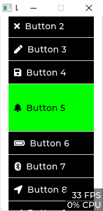

# LVGL 风格样式转换 TRANSITION

::: tip 看上去一点用都没有的文档
[Translation（风格样式转换）](https://lvgl.100ask.net/8.2/overview/coords.html#translation)
:::

## 生成过渡层对象

```c
static lv_style_transition_dsc_t trans; // 定义一个过渡层对象
```

## 设置需要过渡的属性 style properties

```c
static const lv_style_prop_t trans_props[] = {
        LV_STYLE_BG_COLOR,
        LV_STYLE_TRANSFORM_WIDTH,
        LV_STYLE_TRANSFORM_HEIGHT,
        LV_STYLE_TRANSLATE_X,
        LV_STYLE_TRANSLATE_Y,
        LV_STYLE_OPA,
};
```

属性地址 : `lv_style.h` => `lv_style_prop_t`

## 初始化过渡层对象

```c
lv_style_transition_dsc_init(&trans, trans_props, lv_anim_path_ease_out, 300, 0, NULL);
// 参数 1: 过渡层对象 2: 过渡属性 3: 动画路径 4: 动画时间 5: 延迟时间 6: null

```

动画路径

- `lv_anim_path_linear` 线性
- `lv_anim_path_ease_in` 加速
- `lv_anim_path_ease_out` 减速
- `lv_anim_path_ease_in_out` 加速减速
- `lv_anim_path_overshoot` 回弹
- `lv_anim_path_bounce` 弹跳

## 生成一个样式对象 `lv_style_t` 并设置过渡层对象

::: warning 注意
样式必须有一个过渡层对象才能设置过渡属性
例如 要调整 `width` 必须在 `defult` 中设置 `width`

:::

```c
static lv_style_t *obj_style_focused; // 定义一个样式对象
lv_style_init(&obj_style_focused) // 初始化样式对象
lv_style_set_transition(&obj_style_focused, &trans); // 设置过渡层对象

```

## 设置样式对象的属性

```c
lv_style_set_bg_color(&obj_style_focused, lv_color_hex(0x000000));
 // 默认是蓝色
 // 设置背景颜色为黑色
```

## 添加到组件对象

```c
lv_obj_add_style(obj, &obj_style_focused, LV_STATE_FOCUSED);
// 参数 1: 对象 2: 样式对象 3: 状态
```

组件状态 参考 `lv_obj.h`
::: warning
以下为旧版的状态
新版可能有更多
:::

```c
enum {
    LV_STATE_DEFAULT     =  0x0000,
    LV_STATE_CHECKED     =  0x0001,
    LV_STATE_FOCUSED     =  0x0002,
    LV_STATE_FOCUS_KEY   =  0x0004,
    LV_STATE_EDITED      =  0x0008,
    LV_STATE_HOVERED     =  0x0010,
    LV_STATE_PRESSED     =  0x0020,
    LV_STATE_SCROLLED    =  0x0040,
    LV_STATE_DISABLED    =  0x0080,

    LV_STATE_USER_1      =  0x1000,
    LV_STATE_USER_2      =  0x2000,
    LV_STATE_USER_3      =  0x4000,
    LV_STATE_USER_4      =  0x8000,

    LV_STATE_ANY = 0xFFFF,    /**< Special value can be used in some functions to target all states*/
};

typedef uint16_t lv_state_t;
```

## 示例

```c
void transiton_test()
{
    lv_obj_t *sct = lv_obj_create(NULL); // 生成窗口
    lv_scr_load(sct);                    // 加载窗口

    lv_obj_set_scrollbar_mode(sct, LV_SCROLLBAR_MODE_OFF); // 禁止窗口滚动条

    static lv_style_transition_dsc_t trans; // 过渡层对象
    static const lv_style_prop_t trans_props[] = {
        LV_STYLE_BG_COLOR,
        LV_STYLE_TRANSFORM_WIDTH,
        LV_STYLE_TRANSFORM_HEIGHT,
        LV_STYLE_TRANSLATE_X,
        LV_STYLE_TRANSLATE_Y,
        LV_STYLE_TRANSFORM_ZOOM,
    }; // 过渡属性

    // 参数 1：过渡层对象 参数 2：过渡属性  参数 3：过渡路径  参数 4：过渡时间  参数 5：延迟时间  参数 6：用户数据
    lv_style_transition_dsc_init(&trans, trans_props,
                                 lv_anim_path_ease_in_out, 300, 0, NULL); // 初始化过渡层对象

    static lv_style_t style_trans; // focused 状态下的样式
    lv_style_init(&style_trans);  // 初始化样式
    lv_style_set_transition(&style_trans, &trans); // 设置过渡层对象

    lv_obj_t *btn = lv_btn_create(sct); // 生成按钮
    lv_obj_t *label = lv_label_create(btn); // 生成标签
    lv_label_set_text(label, "Button"); // 设置标签文本
    lv_obj_set_x(btn, 0); //! 设置按钮 x 坐标 必需设置 否则无法过渡
    lv_obj_set_y(btn, 0); //! 设置按钮 y 坐标 必需设置 否则无法过渡
    lv_obj_set_size(btn, 50, 50); //! 设置按钮大小 必需设置 否则无法过渡
    // lv_obj_add_flag(btn, LV_OBJ_FLAG_CLICKABLE);

    // lv_obj_add_state(btn, LV_STATE_FOCUSED);

    lv_obj_set_style_bg_color(btn, lv_color_hex(0x000000), 0); // 设置背景颜色
    lv_style_set_bg_color(&style_trans, lv_palette_main(LV_PALETTE_RED)); // 设置 focused 状态下的背景颜色
    lv_style_set_translate_x(&style_trans, 100); // 设置 focused 状态下的 x 坐标
    lv_style_set_translate_y(&style_trans, 100); // 设置 focused 状态下的 y 坐标
    lv_style_set_width(&style_trans, 100); // 设置 focused 状态下的宽度
    lv_style_set_height(&style_trans, 100); // 设置 focused 状态下的高度
    lv_obj_add_style(btn, &style_trans, LV_STATE_FOCUSED); // 添加 focused 状态下的样式
}
```

例子 2



```c
void transition_list()
{

    // define obj
    lv_obj_t *scr = lv_obj_create(NULL);
    lv_obj_t *list = lv_list_create(scr);

    // define transition object
    static lv_style_transition_dsc_t list_item_trans;
    static const lv_style_prop_t list_item_trans_props[] = {
        LV_STYLE_PAD_TOP,
        LV_STYLE_PAD_BOTTOM,
        LV_STYLE_BG_COLOR,
        LV_STYLE_WIDTH,
        LV_STYLE_HEIGHT,


    };
    lv_style_transition_dsc_init(&list_item_trans,&list_item_trans_props,lv_anim_path_ease_in_out ,300,0,NULL);

    // define default style
    static lv_style_t list_item_style_default;
    lv_style_init(&list_item_style_default);
    lv_style_set_bg_color(&list_item_style_default, lv_color_hex(0x000000));
    lv_style_set_text_color(&list_item_style_default, lv_color_hex(0xffffff));
    lv_style_set_size(&list_item_style_default, 30);
    lv_style_set_pad_top(&list_item_style_default, 10);
    lv_style_set_pad_bottom(&list_item_style_default, 10);


    // define transition style
    static lv_style_t list_item_focused_style;
    lv_style_init(&list_item_focused_style);
    lv_style_set_transition(&list_item_focused_style, &list_item_trans);
    lv_style_set_bg_color(&list_item_focused_style, lv_color_hex(0x00ff00));
    lv_style_set_text_color(&list_item_focused_style, lv_color_hex(0x000000));
    lv_style_set_pad_top(&list_item_focused_style, 30);
    lv_style_set_pad_bottom(&list_item_focused_style, 30);


    // main
    lv_scr_load(scr);

    lv_obj_set_scrollbar_mode(scr, LV_SCROLLBAR_MODE_OFF);
    lv_obj_set_scroll_snap_y(list, LV_SCROLL_SNAP_CENTER);

    lv_obj_set_size(list, 170, 380);
    lv_obj_set_x(list, 0);
    lv_obj_set_y(list, -60);
    lv_obj_set_scroll_snap_y(list, LV_SCROLL_SNAP_CENTER);
    lv_obj_set_scrollbar_mode(list, LV_SCROLLBAR_MODE_OFF);


    // btn
    lv_obj_t *btn1 = lv_list_add_btn(list, LV_SYMBOL_OK, "Button 1");
    lv_obj_add_style(btn1, &list_item_style_default, 0);
    lv_obj_add_style(btn1, &list_item_focused_style, LV_STATE_FOCUSED);


    lv_obj_t *btn2 = lv_list_add_btn(list, LV_SYMBOL_CLOSE, "Button 2");
    lv_obj_add_style(btn2, &list_item_style_default, 0);
    lv_obj_add_style(btn2, &list_item_focused_style, LV_STATE_FOCUSED);

    lv_obj_t *btn3 = lv_list_add_btn(list, LV_SYMBOL_EDIT, "Button 3");
    lv_obj_add_style(btn3, &list_item_style_default, 0);
    lv_obj_add_style(btn3, &list_item_focused_style, LV_STATE_FOCUSED);


    lv_obj_t *btn4 = lv_list_add_btn(list, LV_SYMBOL_SAVE, "Button 4");
    lv_obj_add_style(btn4, &list_item_style_default, 0);
    lv_obj_add_style(btn4, &list_item_focused_style, LV_STATE_FOCUSED);

    lv_obj_t *btn5 = lv_list_add_btn(list, LV_SYMBOL_BELL, "Button 5");
    lv_obj_add_style(btn5, &list_item_style_default, 0);
    lv_obj_add_style(btn5, &list_item_focused_style, LV_STATE_FOCUSED);


    lv_obj_t *btn6 = lv_list_add_btn(list, LV_SYMBOL_BATTERY_FULL, "Button 6");
    lv_obj_add_style(btn6, &list_item_style_default, 0);
    lv_obj_add_style(btn6, &list_item_focused_style, LV_STATE_FOCUSED);

    lv_obj_t *btn7 = lv_list_add_btn(list, LV_SYMBOL_BLUETOOTH, "Button 7");
    lv_obj_add_style(btn7, &list_item_style_default, 0);
    lv_obj_add_style(btn7, &list_item_focused_style, LV_STATE_FOCUSED);

    lv_obj_t *btn8 = lv_list_add_btn(list, LV_SYMBOL_GPS, "Button 8");
    lv_obj_add_style(btn8, &list_item_style_default, 0);
    lv_obj_add_style(btn8, &list_item_focused_style, LV_STATE_FOCUSED);


    lv_obj_t *btn9 = lv_list_add_btn(list, LV_SYMBOL_OK, "Button 9");
    lv_obj_add_style(btn9, &list_item_style_default, 0);
    lv_obj_add_style(btn9, &list_item_focused_style, LV_STATE_FOCUSED);


    lv_obj_t *btn10 = lv_list_add_btn(list, LV_SYMBOL_CLOSE, "Button 10");
    lv_obj_add_style(btn10, &list_item_style_default, 0);
    lv_obj_add_style(btn10, &list_item_focused_style, LV_STATE_FOCUSED);


    lv_obj_t *btn11 = lv_list_add_btn(list, LV_SYMBOL_EDIT, "Button 11");
    lv_obj_add_style(btn11, &list_item_style_default, 0);
    lv_obj_add_style(btn11, &list_item_focused_style, LV_STATE_FOCUSED);

    lv_obj_t *btn12 = lv_list_add_btn(list, LV_SYMBOL_SAVE, "Button 12");
    lv_obj_add_style(btn12, &list_item_style_default, 0);
    lv_obj_add_style(btn12, &list_item_focused_style, LV_STATE_FOCUSED);

    lv_obj_t *btn13 = lv_list_add_btn(list, LV_SYMBOL_BELL, "Button 13");
    lv_obj_add_style(btn13, &list_item_style_default, 0);
    lv_obj_add_style(btn13, &list_item_focused_style, LV_STATE_FOCUSED);

    lv_obj_t *btn14 = lv_list_add_btn(list, LV_SYMBOL_BATTERY_FULL, "Button 14");
    lv_obj_add_style(btn14, &list_item_style_default, 0);
    lv_obj_add_style(btn14, &list_item_focused_style, LV_STATE_FOCUSED);


}

```
