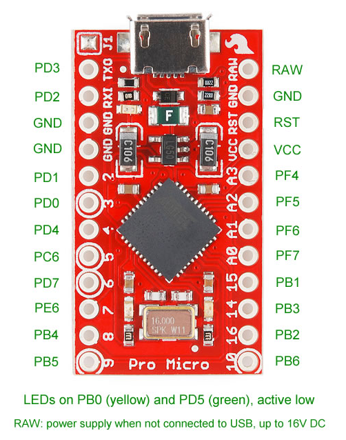

# QMK 笔记

## Github 参考仓库
4x4键盘 
pro micro 芯片  
[qmk_keypad44](https://github.com/kazawan/qmk_keypad44)   

## 文档

::: info   
[qmk.fm-doc / info.json 参考](https://docs.qmk.fm/reference_info_json#info-json-reference)      
[qmk Keycode](https://docs.qmk.fm/keycodes)  
:::

## 工具
::: info  
`烧录工具`       
[QMK TOOLBOX](https://github.com/qmk/qmk_toolbox)  
`编译工具`   
[QMK MSYS](https://msys.qmk.fm/)   
`键盘布局工具`   
[keyboard-layout-editor](http://www.keyboard-layout-editor.com/#/)  
`定位板生成工具`   
[Plate & Case Builder](http://builder.swillkb.com/)    
`懒人qmk固件生成`  
[kbfirmware.com](https://kbfirmware.com/)    
:::


## Matrix 管脚

   
> 不能使用开发版上的管脚定义，需要使用芯片的管脚定义   

```json
    // matrix pins...
    "matrix_pins": {
        "cols": ["F4", "F5", "F6", "F7"],
        "rows": ["D1", "D0", "D4", "C6"]
    },
    // 二极管方向 > 行 到 列...
    "diode_direction": "ROW2COL",
```


## keymap.c 参考
```c

#include QMK_KEYBOARD_H

const uint16_t PROGMEM keymaps[][MATRIX_ROWS][MATRIX_COLS] = {
    /*
     * ┌───┬───┬───┬───┐
     * │ 7 │ 8 │ 9 │ - │
     * ├───┼───┼───┤───│
     * │ 4 │ 5 │ 6 │ + │
     * ├───┼───┼───┼───┤
     * │ 1 │ 2 │ 3 │   │
     * ├───┼───┼───┤Ent│
     * │ 0 │ . │m-0│   │
     * └───┴───┴───┴───┘
     */
    [0] = LAYOUT(
        KC_P7,   KC_P8,   KC_P9,   KC_PMNS,
        KC_P4,   KC_P5,   KC_P6,   KC_PPLS,
        KC_P1,   KC_P2,   KC_P3,   KC_ENT,
        KC_P0,   KC_PDOT, M0_1
    )
};
```


