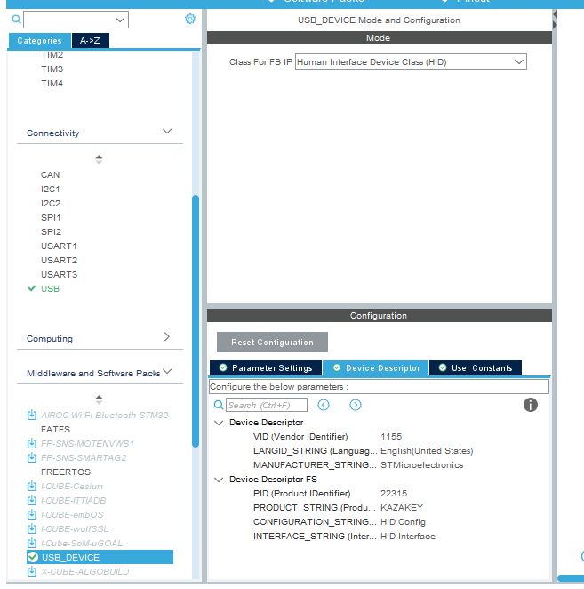

# STM32 USB-HID 键盘简单配置

::: tip 参考
[Use STM32 as a KEYBOARD || F103C8 || USB Device HID](https://www.youtube.com/watch?v=tj1_hsQ5PR0&t=946s)
:::

## CUBEMX 配置

Connectivity -> USB
选择 Device(FS)


Middleware 中间件 -> USB_DEVICE
选择 Human Interface Device Class(HID)


## 代码配置

### platformIO.ini 配置文件

```ini
[env:genericSTM32F103C8]
platform = ststm32
board = genericSTM32F103C8
; framework = stm32cube
build_flags = 
	-D STM32F103xx
	-ICore/Inc
	-IDrivers/CMSIS/Include
	-IDrivers/CMSIS/Device/ST/STM32F1xx/Include
	-IDrivers/STM32F1xx_HAL_Driver/Inc
	-IDrivers/STM32F1xx_HAL_Driver/Inc/Legacy
	-IUSB_DEVICE/App
	-IUSB_DEVICE/Target
	-IMIDDLEWARES/ST/STM32_USB_Device_Library/Class/HID/Inc
	-IMIDDLEWARES/ST/STM32_USB_Device_Library/Core/Inc

src_filter = +<Core/Src> +<startup_stm32f103xb.s> +<Drivers/> +<Middlewares/>+<Usb_device/>
board_build.ldscript = ./STM32F103C8Tx_FLASH.ld
upload_protocol = stlink 
debug_tool = stlink


[platformio]
src_dir = ./
include_dir = Core/Inc
```

### USBD_HID.H

`./Middlewares/ST/STM32_USB_Device_Library/Class/HID/Src/usbd_hid.c`

查找 `USBD_HID_CfgFSDesc` -> `nInterfaceProtocol` 修改成 `0x01`

```c
//./Middlewares/ST/STM32_USB_Device_Library/Class/HID/Src/usbd_hid.c
 0x01,                    /*nInterfaceProtocol : 0=none, 1=keyboard, 2=mouse*/
```

向下继续找到 `HID_MOUSE_ReportDesc`
修改报文

```c
//./Middlewares/ST/STM32_USB_Device_Library/Class/HID/Src/usbd_hid.c
__ALIGN_BEGIN static uint8_t HID_MOUSE_ReportDesc[HID_MOUSE_REPORT_DESC_SIZE] __ALIGN_END =
    {
        0x05, 0x01, // USAGE_PAGE (Generic Desktop)
        0x09, 0x06, // USAGE (Keyboard)
        0xa1, 0x01, // COLLECTION (Application)
        0x05, 0x07, //   USAGE_PAGE (Keyboard)
        0x19, 0xe0, //   USAGE_MINIMUM (Keyboard LeftControl)
        0x29, 0xe7, //   USAGE_MAXIMUM (Keyboard Right GUI)
        0x15, 0x00, //   LOGICAL_MINIMUM (0)
        0x25, 0x01, //   LOGICAL_MAXIMUM (1)
        0x75, 0x01, //   REPORT_SIZE (1)
        0x95, 0x08, //   REPORT_COUNT (8)
        0x81, 0x02, //   INPUT (Data,Var,Abs)
        0x95, 0x01, //   REPORT_COUNT (1)
        0x75, 0x08, //   REPORT_SIZE (8)
        0x81, 0x03, //   INPUT (Cnst,Var,Abs)
        0x95, 0x05, //   REPORT_COUNT (5)
        0x75, 0x01, //   REPORT_SIZE (1)
        0x05, 0x08, //   USAGE_PAGE (LEDs)
        0x19, 0x01, //   USAGE_MINIMUM (Num Lock)
        0x29, 0x05, //   USAGE_MAXIMUM (Kana)
        0x91, 0x02, //   OUTPUT (Data,Var,Abs)
        0x95, 0x01, //   REPORT_COUNT (1)
        0x75, 0x03, //   REPORT_SIZE (3)
        0x91, 0x03, //   OUTPUT (Cnst,Var,Abs)
        0x95, 0x06, //   REPORT_COUNT (6)
        0x75, 0x08, //   REPORT_SIZE (8)
        0x15, 0x00, //   LOGICAL_MINIMUM (0)
        0x25, 0x65, //   LOGICAL_MAXIMUM (101)
        0x05, 0x07, //   USAGE_PAGE (Keyboard)
        0x19, 0x00, //   USAGE_MINIMUM (Reserved (no event indicated))
        0x29, 0x65, //   USAGE_MAXIMUM (Keyboard Application)
        0x81, 0x00, //   INPUT (Data,Ary,Abs)
        0xc0        // END_COLLECTION
};
```

点击 `HID_MOUSE_REPORT_DESC_SIZE` 导向到头文件修改长度为 `63U`

`./Middlewares/ST/STM32_USB_Device_Library/Class/HID/Inc/usbd_hid.h`

```c
//./Middlewares/ST/STM32_USB_Device_Library/Class/HID/Inc/usbd_hid.h
#define HID_MOUSE_REPORT_DESC_SIZE    63U
```

### main.c

```c

/* USER CODE BEGIN Includes */
#include "usbd_hid.h"


/* USER CODE END Includes */


/* USER CODE BEGIN 0 */
extern USBD_HandleTypeDef hUsbDeviceFS;

typedef struct{
  uint8_t MODIFIER;
  uint8_t RESERVED;
  uint8_t KEYCODE1;
  uint8_t KEYCODE2;
  uint8_t KEYCODE3;
  uint8_t KEYCODE4;
  uint8_t KEYCODE5;
  uint8_t KEYCODE6;
}keyboardHID_t;

keyboardHID_t keyboardHID = {0, 0, 0, 0, 0, 0, 0, 0};


/* USER CODE END 0 */
```

大循环中...

```c
    keyboardHID.KEYCODE1 = 0x04;
    USBD_HID_SendReport(&hUsbDeviceFS, &keyboardHID, sizeof(keyboardHID));
    HAL_Delay(100);
    keyboardHID.KEYCODE1 = 0x00;
    USBD_HID_SendReport(&hUsbDeviceFS, &keyboardHID, sizeof(keyboardHID));
    HAL_Delay(1000);
```

## 完成

插入USB 每隔一秒按一个 `a`
