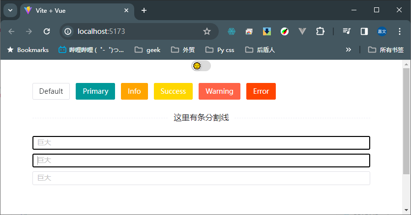

# ⌨️Naive-UI 输入框 input 样式修改

## ✂️ 使用 `<NThemeEditor>` 修改

::: tip 参考
[主题编辑器](https://www.naiveui.com/zh-CN/os-theme/docs/customize-theme)
:::

主题编辑器
naive-ui 提供主题编辑器帮助你方便的编辑主题并导出对应配置。它可以被嵌套于 n-config-provider 中。

主题编辑器不包含在全局安装中（app.use(naive)）。你需要显式引入来使用它。

```js
<template>
  <n-theme-editor>
    <app />
  </n-theme-editor>
</template>

<script>
  import { defineComponent } from 'vue'
  import { NThemeEditor } from 'naive-ui'

  export default defineComponent({
    components: {
      NThemeEditor
    }
  })
</script>
```

得出`<n-input>` 样式参数,修改丑陋的 board focus 边框 和底色

## ✂️ 使用 `<n-config-provider>` 同步样式

样式 override

```js
const darkThemeOverrides = {
  common: {
    primaryColor: "#009999", //主颜色
    infoColor: "#FFA500",
    warningColor: "#FF6347",
    successColor: "#FFD700",
    errorColor: "#FF4500",
  },
  Input: {
    caretColor: "#A6A6A6FF", //光标颜色
    borderRadius: "3px",
    borderFocus: "2px solid #000", //聚焦时边框样式
    boxShadowFocus: "2px solid #000", //聚焦时边框阴影样式
    borderHover: "2px solid #000",
    colorFocus: "#3E3E3EFF", //聚焦时input框里面背景颜色
  },
  Button: {
    colorHoverPrimary: "#66CCCC",
    borderHoverPrimary: "2px solid #009999",
  },
};

const lightThemeOverrides = {
  common: {
    primaryColor: "#009999",
    infoColor: "#FFA500",
    warningColor: "#FF6347",
    successColor: "#FFD700",
    errorColor: "#FF4500",
  },
  Input: {
    caretColor: "#A6A6A6FF",
    borderRadius: "3px",
    borderFocus: "2px solid #000", //聚焦时边框样式
    boxShadowFocus: "2px solid #000", //聚焦时边框阴影样式
    borderHover: "2px solid #000",
    colorFocus: "#fff", //聚焦时input框里面背景颜色
  },
  Button: {
    colorHoverPrimary: "#66CCCC",
    borderHoverPrimary: "2px solid #009999",
  },
};
```

在 vue 中使用`<n-config-provider>`

```js
<n-config-provider
    :theme="toggleTheme"
    :themeOverrides="
      toggleTheme === null ? lightThemeOverrides : darkThemeOverrides
    "
  >
<app />
</n-config-provider>

```

## 完成修改

