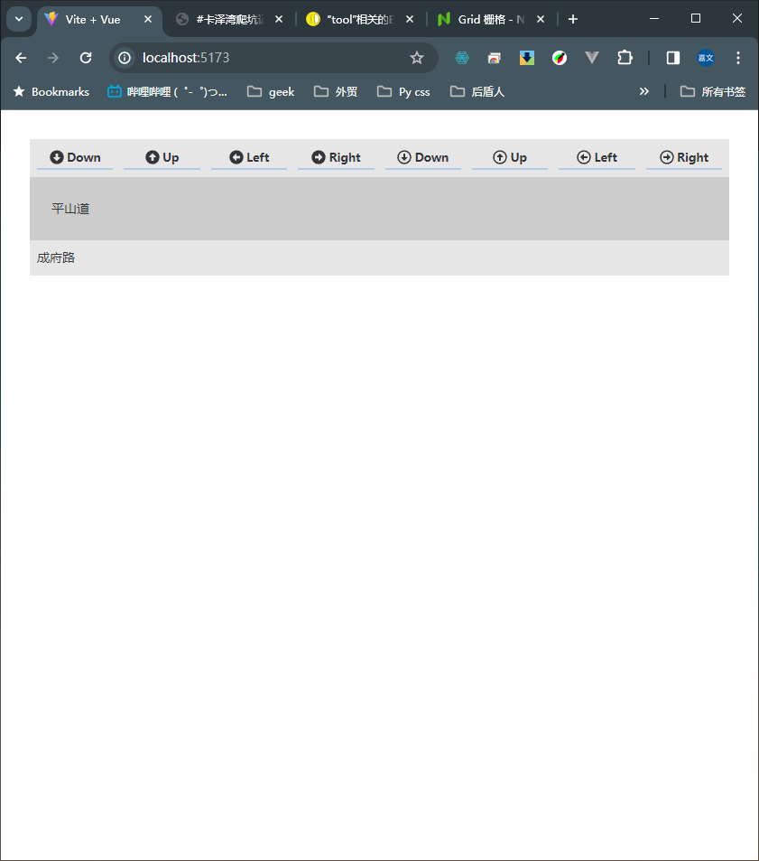
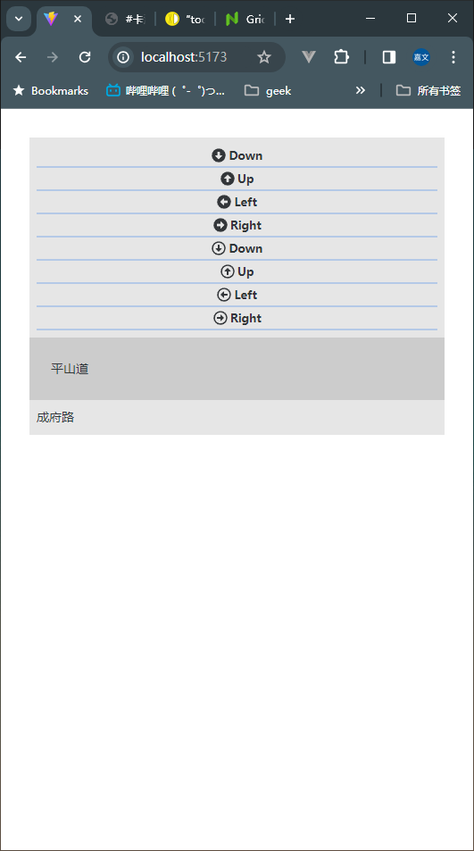

# ✂️响应式navi-bar

::: warning ⚠️ 注意
基于 Naive UI   
[https://www.naiveui.com/zh-CN/os-theme](https://www.naiveui.com/zh-CN/os-theme)
:::

## 🔮 Naive UI Grid 栅格
[# Grid 栅格](https://www.naiveui.com/zh-CN/os-theme/components/grid)

```vue
<script setup>
import {
  ArrowAltCircleDown,
  ArrowAltCircleUp,
  ArrowAltCircleLeft,
  ArrowAltCircleRight,
  ArrowAltCircleDownRegular,
  ArrowAltCircleUpRegular,
  ArrowAltCircleLeftRegular,
  ArrowAltCircleRightRegular,
} from "@vicons/fa";


</script>

<template>
  <n-grid x-gap="12" :cols="8" item-responsive >
    <n-gi span="0 400:8 600:1  " >
      
        <div class="light-green">
          <n-icon :component="ArrowAltCircleDown" size="1rem" />
          <n-text v-show="!isMobile">Down</n-text>
        </div>
      
    </n-gi>
    <n-gi span="0 400:8 600:1  " >
      <div class="light-green">
        <n-icon :component="ArrowAltCircleUp" size="1rem" />
        <n-text v-show="!isMobile">Up</n-text>
      </div>
    </n-gi>
    <n-gi span="0 400:8 600:1  " >
      <div class="light-green">
        <n-icon :component="ArrowAltCircleLeft" size="1rem" />
        <n-text v-show="!isMobile">Left</n-text>
      </div>
    </n-gi>
    <n-gi span="0 400:8 600:1  " >
      <div class="light-green">
        <n-icon :component="ArrowAltCircleRight" size="1rem" />
        <n-text v-show="!isMobile">Right</n-text>
      </div>
    </n-gi>
    <n-gi span="0 400:8 600:1  " >
      <div class="light-green">
        <n-icon :component="ArrowAltCircleDownRegular" size="1rem" />
        <n-text v-show="!isMobile">Down</n-text>
      </div>
    </n-gi>
    <n-gi span="0 400:8 600:1  " >
      <div class="light-green">
        <n-icon :component="ArrowAltCircleUpRegular" size="1rem" />
        <n-text v-show="!isMobile">Up</n-text>
      </div>
    </n-gi>
    <n-gi span="0 400:8 600:1  " >
      <div class="light-green">
        <n-icon :component="ArrowAltCircleLeftRegular" size="1rem" />
        <n-text v-show="!isMobile">Left</n-text>
      </div>
    </n-gi>
    <n-gi span="0 400:8 600:1  " >
      <div class="light-green">
        <n-icon :component="ArrowAltCircleRightRegular" size="1rem" />
        <n-text v-show="!isMobile">Right</n-text>
      </div>
    </n-gi>
  </n-grid>
</template>

<style scoped>
.light-green {
  height: 1.5rem;
  /* background-color: rgba(102, 233, 238, 0.5); */
  display: flex;
  flex-direction: row;
  align-items: center;
  justify-content: center;
  /* border-radius: 5px; */
  gap: 0.2rem;
  overflow: hidden;
  user-select: none;
  cursor: pointer;
  border-bottom: 2px solid rgba(21, 107, 235, 0.24);
}
.n-text {
  font-size: 0.8rem;
  font-weight: 800;
}
.green {
  height: 2rem;
  background-color: rgba(0, 128, 0, 0.24);
}
</style>
```

正常效果



浏览器宽度减少后


